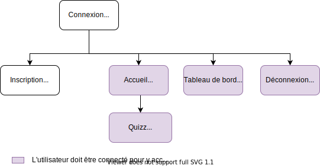

# Architecture-logicielle-projet-final

## Introduction

Ce projet a été réalisé dans le cadre de notre Master sur le cours : Application Logicielle.

**Contexte**

Vous avez en charge la réalisation d’une mini-application implémentant un jeu de culture générale.

Le but de cette application est de proposer une interface web permettant à un utilisateur de lancer une partie à partir d’un ensemble de questions, en fonction d’une catégorie pré-sélectionnée.

**Les objectifs à remplir :**

- [x] pouvoir s’inscrire et se connecter ; le jeu sera accessible uniquement aux utilisateurs inscrits et connectés
- [x] pouvoir jouer une partie, en fonction de divers paramètres (nombre de questions, catégorie, difficulté, etc...)
- [x]  pouvoir consulter ses scores : un utilisateur connecté doit pouvoir visualiser les scores qu’il a obtenu lors des parties passées

Ce qui a été réaliser en plus : 
- [x] Application responsive
- [x] Gestion des erreurs

**Contributeurs:**

Les membres constituant le groupe sont les suivants :

- Axelle Guinaudeau ([Theia01](https://github.com/Theia01))
- Thomas Mary ([Marthy28](https://github.com/Marthy28))


&nbsp;


## Getting started

### Dépendances requises :

Avant toute chose, certaines installations sont **requises** pour pouvoir utiliser ce projet :

- [Node.js](https://nodejs.org/en/download/) (version 14 ou supérieure)


### Mettre en place le projet

Il vous faut ensuite **cloner le projet :**

```sh
git clone git@github.com:Theia01/Architecture-logicielle-projet-final.git
```

Une fois cela fait, rentrez dans le fichier créé et exécutez les commandes suivantes :

```sh
npm i
cd ./app/
npm i
cd ./../
```

Enfin, **lancez l'application** avec deux terminaux. Un terminal sera pour les divers microservices :

```sh
sh ./launch.sh
```

Puis ouvrez un deuxième terminal à la racine du projet et exécuter ces commande.

```sh
cd ./app/
node app.js
```

Une fois l'application lancé, vous n'avez plus qu'a vous rendre sur : [http://localhost:3000/](http://localhost:3000/)

&nbsp;

## Plan du site


